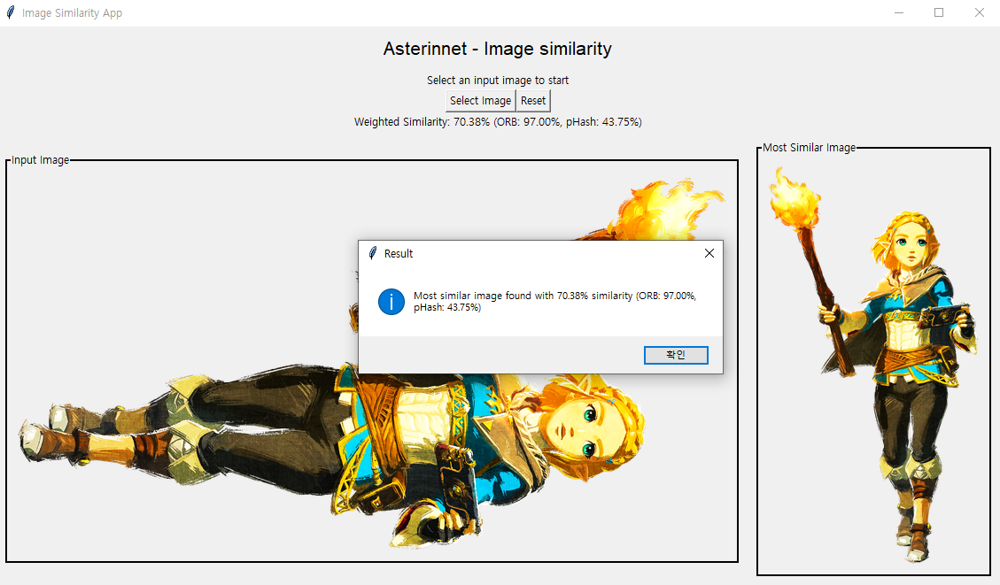

# Simple Image Similarity

A simple Python app for retrieving the closest image by calculating image similarity.

figure1: Usage example

Sample imageset source: https://www.zeldadungeon.net/wiki/Gallery:Tears_of_the_Kingdom_Characters